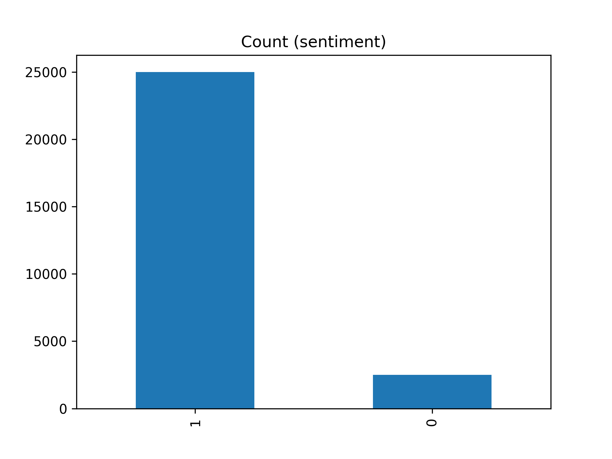

# Sentiment API
***
### Install required packages

    pip3 install -r requirements.txt
***
### Data:

We have imbalanced datasets.


A widely adopted technique for dealing with highly unbalanced datasets is called resampling. It consists of removing
samples from the majority class (under-sampling) and / or adding more examples from the minority class (over-sampling).
Inside data_proc implemented over and under resampling.

Another technique
is [focal loss](https://www.tensorflow.org/addons/api_docs/python/tfa/losses/sigmoid_focal_crossentropy). This loss is
often used if trainings set consists of many labels and/or is highly imbalanced.

To preprocess (normalize text) and split dataset into train/dev/test run:
    
    python -m sentiment_model.data_proc.processor

The command will generate under, over and normal sampled datasets and will save as a csv files inside data folder.

[TextVectorization](https://www.tensorflow.org/api_docs/python/tf/keras/layers/TextVectorization) used preprocessing layer from TensorFlow.

[Embedding](https://www.tensorflow.org/api_docs/python/tf/keras/layers/Embedding) used layer from TensorFlow
***

## Models:

* Model 0: Naive Bayes (baseline)
* Model 1: Feed-forward neural network (dense model)
* Model 2: LSTM model
* Model 3: GRU model
* Model 4: Bidirectional-LSTM model
* Model 5: 1D Convolutional Neural Network
* Model 6: TensorFlow Hub Pretrained Feature Extractor
* Model 7: Same as model 6 with 10% of training data
***
### Model Train and Save

For train and save model run:

     python3 -m sentiment_model.training.train_models --data norm --model lstm

***
### Arguments documentation for training module:

```
--data    norm
          over
          under               
```
This argument will set dataset that generated basd of sampling techniques 

```
--model    simple_dense
           lstm
           gru
           bidirectional
           conv1d 
           tf_hub_sentence_encoder
           tf_hub_10_percent_data
           all                
```
This argument will set one of seven s model for training and save.

If set "--model all", the command will train and save all seven models sequentially based on the set dataset. And will generate and save follow diagrams in models_results_plot folder.

Confusion matrix of each model will be saved as a matrix_plots folder.

Models will be saved inside models folder. 
***
### Comparing the performance of each of models

Model's performances


Sorted model results by f1-score

***
### Model ensembling/stacking

Baseline model (model_0), LSTM model (model_2) and USE model trained on the full training data (model_6) by averaging the combined prediction probabilities of each.


***
## Build a Docker Image

    docker build -t imbd-classification-api -f Dockerfile .

The command will build image and will run.

If some issue with permission we can use sudo docker.

    docker ps

This command will show containers are currently running.

    docker stop <container-name>

The command will stop the currently running container.

    docker rmi -f <image-id>

The command will remove the image.
***

## Run API
***
We have 2 option to run API:
1. without docker
2. inside docker
***
### Run API without docker

     python3 -m sentiment_model.app

***

### Run API inside docker

    docker build -t imbd-classification-api -f Dockerfile .

The command will build image and will run. 
***

### Test API

For example, set running host and model and execute:

    curl  -X POST -d '{"review": "A very good story for a film which if done properly would be quite interesting, but where the hell is the ending to this film?<br /><br />In fact, what is the point of it?<br /><br />The scenes zip through so quick that you felt you were not part of the film emotionally, and the feeling of being detached from understanding the storyline.<br /><br />The performances of the cast are questionable, if not believable.<br /><br />Did I miss the conclusion somewhere in the film? I guess we have to wait for the sequel.<br /><br />","model":"lstm"}'  http://172.17.0.2:8080/identify_sentiment -H "Content-Type:application/json"


**Here is an example response of `identify_sentiment` prediction endpoint:**

```json
[
  {
    "label": "positive",
    "probability": "0.80608344"
  }
]
```