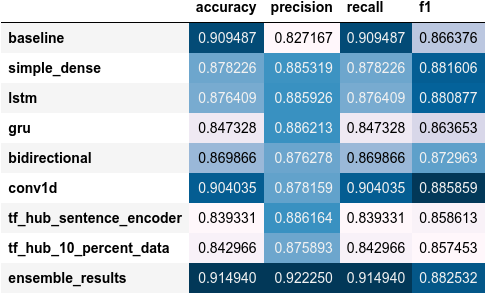

# Sentiment API

### To test in local environment run:

    curl  -X POST -d '{"review": "A very good story for a film which if done properly would be quite interesting"}' http://localhost:8080/identify_sentiment -H "Content-Type:application/json"

**Here is an example response of `identify_sentiment` prediction endpoint:**

```json
[
  {
    "label": "positive",
    "probability": "0.80608344"
  }
]
```

### Data:

We have imbalanced datasets.


A widely adopted technique for dealing with highly unbalanced datasets is called resampling. It consists of removing
samples from the majority class (under-sampling) and / or adding more examples from the minority class (over-sampling).
Inside data_proc implemented over and under resampling.


Another technique
is [focal loss](https://www.tensorflow.org/addons/api_docs/python/tfa/losses/sigmoid_focal_crossentropy). This loss is
often used if trainings set consists of many labels and/or is highly imbalanced.


[TextVectorization](https://www.tensorflow.org/api_docs/python/tf/keras/layers/TextVectorization) used preprocessing layer from TensorFlow.

[Embedding](https://www.tensorflow.org/api_docs/python/tf/keras/layers/Embedding) used layer from TensorFlow

### Model:

* Model 0: Naive Bayes (baseline)
* Model 1: Feed-forward neural network (dense model)
* Model 2: LSTM model
* Model 3: GRU model
* Model 4: Bidirectional-LSTM model
* Model 5: 1D Convolutional Neural Network
* Model 6: TensorFlow Hub Pretrained Feature Extractor
* Model 7: Same as model 6 with 10% of training data

### Comparing the performance of each of models

Model's performances


Sorted model results by f1-score


### Model ensembling/stacking

Baseline model (model_0), LSTM model (model_2) and USE model trained on the full training data (model_6) by averaging the combined prediction probabilities of each.



Inside config file could be set active model path 

